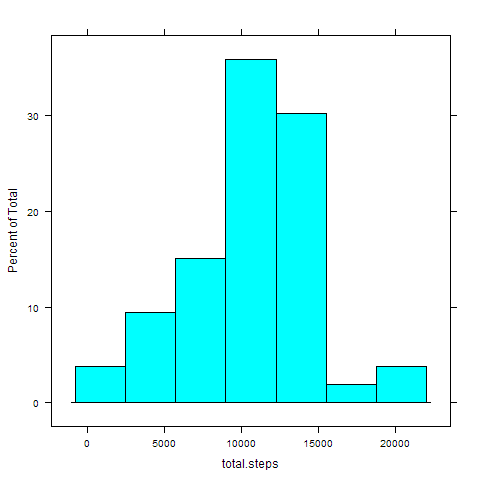
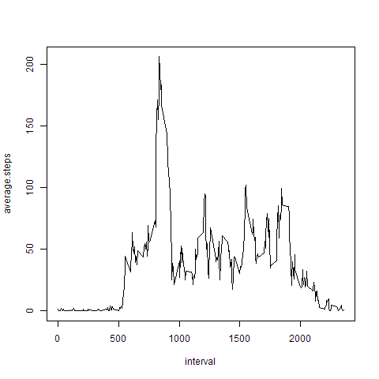
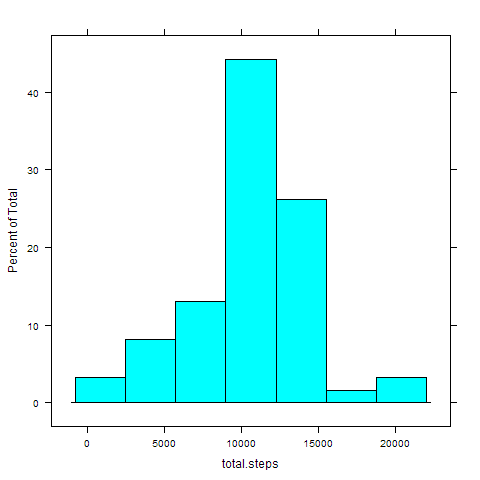
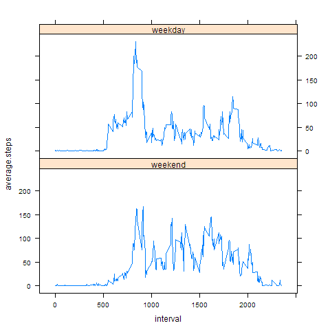

# Reproducible Research: Peer Assessment 1


## Loading and preprocessing the data
No preprocessing was done here.

```r
unzip("activity.zip")
activity.dat <- read.csv("activity.csv")
library(dplyr)
library(lattice)
```
## What is mean total number of steps taken per day?
1. Make a histogram of the total number of steps taken each day
* Filter out missing values of steps
* Group by date
* Calculate the total number of steps for each day
* Make a histogram of the total number of steps taken each day

```r
total.per.day <- activity.dat %>% filter(is.na(steps) == FALSE) %>% group_by(date) %>% summarise(total.steps = sum(steps))
png("figures/totalsteps1.png")
histogram(~total.steps, data = total.per.day)
dev.off()
```


2. The mean and median total number of steps taken per day  


```r
mean(total.per.day$total.steps)
```

```
## [1] 10766.19
```

```r
median(total.per.day$total.steps)
```

```
## [1] 10765
```

## What is the average daily activity pattern?
1. Make a time series plot of the 5-minute interval (x-axis) and the average number of steps taken, averaged across all days (y-axis)
* Filter out the missing values of steps
* Group by interval 
* Calculate the average across all days for each interval
* Make the plot

```r
daily.timeseries <- activity.dat %>% filter(is.na(steps) == FALSE) %>% group_by(interval) %>% summarise(average.steps = mean(steps))
png("figures/dailyTimeseries1.png")
plot(daily.timeseries, type="l")
dev.off()
```
Daily pattern  


2. Which 5-minute interval, on average across all the days in the dataset, contains the maximum number of steps?
interval average.steps
     

```r
filter(daily.timeseries, average.steps == max(daily.timeseries$average.steps))
```

```
## Source: local data frame [1 x 2]
## 
##   interval average.steps
##      (int)         (dbl)
## 1      835      206.1698
```


## Imputing missing values
1. The total number of missing values in the dataset  


```r
sum(is.na(activity.dat$steps))
```

```
## [1] 2304
```
2. Replace the missing values in the dataset with **the mean for that 5-minute interval** 
* Add a new variable **dateasdate** to contain the date in Date type
* Copy the raw data into a new data frame **activity.fill** to fill in missing values
* Go through each row, get the *interval id*, and look up for the corresponding mean value from the *daily.timeseries* (see the previous code to create daily activity pattern.)

```r
activity.dat$dateasdate <- as.Date(activity.dat$date)
activity.fill <- activity.dat[, c(1,3,4)]
for (i in 1:nrow(activity.fill)){
	if (is.na(activity.fill$steps[i]) == T)
	{
		intervalid <- activity.fill$interval[i]
		activity.fill$steps[i] <- subset(daily.timeseries, interval == intervalid)$average.steps
	}
}
```

3. Make a histogram of the total number of steps taken each day

```r
totalsteps2 <- summarise(group_by(activity.fill, dateasdate), total.steps = sum(steps))
png("figures/totalsteps2.png")
histogram(~total.steps, data = totalsteps2)
dev.off()
```


Calclate the **meand** and **median** total number of steps taken per day

```r
mean(totalsteps2$total.steps)
```

```
## [1] 10766.19
```

```r
median(totalsteps2$total.steps)
```

```
## [1] 10766.19
```
The estimates for mean and median from the first part of the assignment are 10766.19 and 10765 steps. Compared with the estimates in this part, the mean is the same; the new median is larger but closer to the new mean. That is because imputing missing data results into more observations of daily total of steps and the new obsservations have values close to the mean total of steps per day.

## Are there differences in activity patterns between weekdays and weekends?
1. Create a new factor variable **wday** in the dataset with two levels - "weekday" and "weekend" indicating whether a given date is a weekday or weekend day.
* A vector **wkend** contains weekend days (Saturday, Sunday)
* Use function *weekdays()* on variable **dateasdate**, if the date is weekend, its level is TRUE and labeled with *weekend*. Otherwise, it is labled with *weekday*
2. Group by **wday, interval** and calculate the average steps for each goup. Then make the panel plot to show a time series of the 5-minute interval (x-axis) and the average number of steps taken, averaged across all weekday days or weekend days (y-axis).

```r
wkend <- c("Saturday", "Sunday")
activity.fill$wday <- factor(weekdays(activity.fill$dateasdate) %in% wkend, levels = c(TRUE, FALSE), labels = c("weekend", "weekday"))

daily.timeseries2 <- activity.fill %>% group_by(wday, interval) %>% summarise(average.steps = mean(steps))
png("figures/wdayTimeseries.png")
xyplot(average.steps ~ interval | wday, data = daily.timeseries2, type = "l", layout = c(1,2))
dev.off()
```

